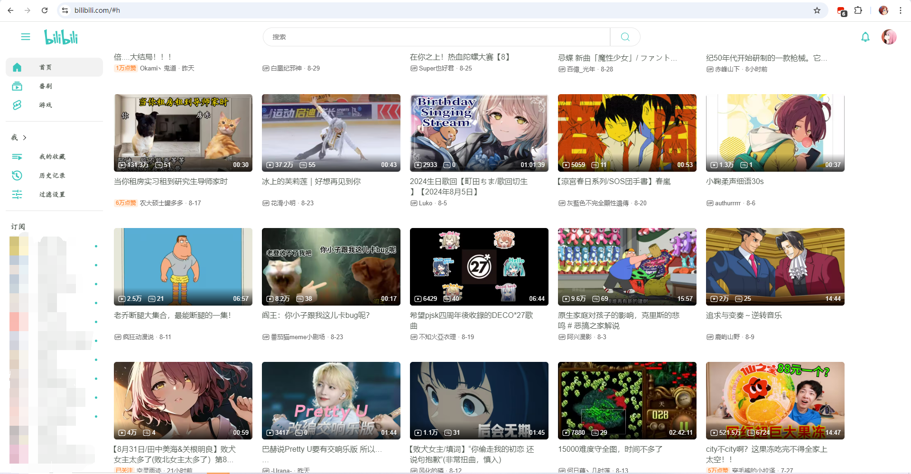

# BilibiliBetterUI - 提升Bilibili用户体验的脚本

BilibiliBetterUI 是一个用户脚本，旨在通过增强和定制Bilibili网站的用户界面，提供更加流畅和高效的使用体验。该脚本通过添加新的导航栏、优化页面布局、增强视频过滤功能等方式，使用户能够更方便地浏览和管理内容。

## 主要功能

1. **新导航栏**：添加了一个全新的侧边导航栏，提供快速访问主页、动漫、游戏、个人动态、收藏、历史记录等功能。
2. **视频过滤**：允许用户根据播放量、关键词等条件过滤视频，减少不感兴趣内容的干扰。
3. **订阅更新提醒**：在订阅的UP主发布新视频时，提供提醒功能。

## 安装指南
1. **安装Tampermonkey**：首先，您需要在浏览器上安装Tampermonkey扩展。Tampermonkey是一个用户脚本管理器，支持多种浏览器。
   - [Chrome](https://chrome.google.com/webstore/detail/tampermonkey/dhdgffkkebhmkfjojejmpbldmpobfkfo)
   - [Firefox](https://addons.mozilla.org/en-US/firefox/addon/tampermonkey/)
   - [Edge](https://microsoftedge.microsoft.com/addons/detail/tampermonkey/iikmkjmpaadaobahmlepeloendndfphd)
   - [Safari](https://apps.apple.com/app/apple-store/id1482490089)

2. **安装BilibiliBetterUI脚本**：
   - [点此安装](https://github.com/Toukaiteio/BilibiliBetterUI/raw/main/release/BetterUI.min.user.js)
   - 或按以下步骤操作
   - 打开Tampermonkey的管理面板。
   - 点击“添加新脚本”。
   - 将BilibiliBetterUI脚本的内容复制粘贴到编辑器中。
   - 保存并启用脚本。
## 使用说明

- **导航栏**：侧边导航栏提供了快速访问各个功能模块的入口。
- **视频过滤**：在设置弹出窗口中，您可以根据需要启用或禁用各种视频过滤条件。
- **用户信息弹出**：点击用户头像时，会弹出用户的详细信息和观看历史记录。
- **订阅更新提醒**：在导航栏中，您可以看到订阅的UP主是否有新视频发布。
- **历史记录刷新**：在用户信息弹出窗口中，您可以刷新观看历史记录以查看最新的记录。

## 贡献

脚本仍处于早起开发阶段，可能会有许多影响用户体验的BUG，当你遇到问题时，欢迎提交issue。

---

感谢使用BilibiliBetterUI！